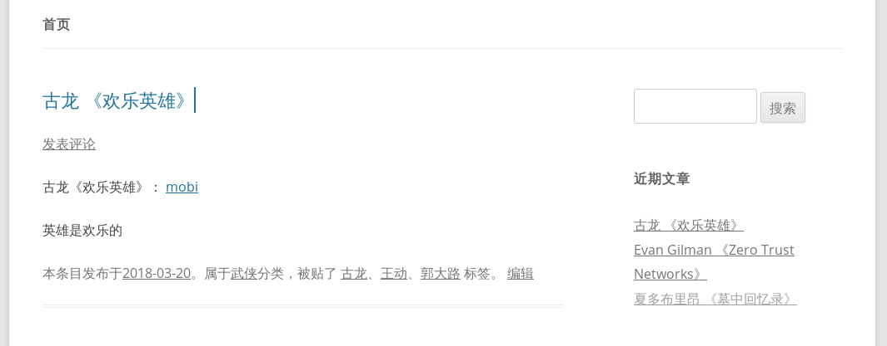

# wordpress_for_ebook
电子书存档

# 安装

需要搭建远程wordpress站点，假设站点为 https://ebook.xxx.com，用户名 someusr, 密码 somepwd，远程路径 /var/www/ebook，电子书所在网站子目录 data

本地配置ansible访问 ebook.xxx.com，以debian环境为例：

    apt-get install ansible cpanminus
    cpanm -n Digest::MD5 Encode::Locale Getopt::Long XMLRPC::Lite

# 示例

    perl save_ebook.pl -s ebook.xxx.com -u someusr -p somepwd -r /var/www/ebook -e data \
                -d 1971 -w 古龙 -b 欢乐英雄 -f 古龙-欢乐英雄.mobi \
                -t 郭大路,王动 -c 武侠 -m 英雄是欢乐的

